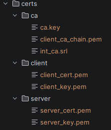

# Telegram AutoShop

## Оглавление
- [О проекте](#-о-проекте)
- [Архитектура](#-архитектура)
- [Быстрый запуск](#-быстрый-запуск)
- [Примечания](#-примечания)
- [Тесты](#тесты)
- [Как быстро смотреть проект](#как-быстро-смотреть-проект)


## 📌 О проекте

Telegram AutoShop — это сервис для автоматизации продаж через Telegram-бота с поддержкой платежей (CryptoBot), очередей (RabbitMQ) и кэширования (Redis).

Стек: Python 3.12.7, Aiogram, FastAPI, PostgreSQL, SQLAchemy(async), Redis, RabbitMQ, Docker / Docker Compose

## 🧱 Архитектура

Проект построен по принципам Clean Architecture:

### Содержание проекта в src:
- `application` — бизнес-логика.
- `domain` — модели и правила.
- `infrastructure` — работа с БД, Redis, RabbitMQ, webhook
- `config` — все настройки бота
- `containers` — два контейнера:
  - AppContainer отвечает за общие переменны проекта на протяжении всего цикла жизни
  - RequestContainer отвечает за зависимости на каждое обращение к боту в основном через handlers
- `database` — БД
- `models` — DTO модели
- `modules` — обработчики и клавиатура
- `repository` — лёгкая работа с БД не несущая бизнес-логики (PostgreSQL, Redis)
- `tool` — инструменты для отдельного запуска
- `main.py` — Запускаемый файл

Внешние зависимости:
- PostgreSQL — основная БД
- Redis — кэш / состояния
- RabbitMQ — очереди
- Secret Storage — управление секретами (опционально)

## 🚀 Быстрый запуск

### 1. Клонирование репозитория

```bash
git clone https://github.com/IvanShankin/Autoshop-telegram-bot.git
cd <repo-name>
```

---

### 2. Настройка webhook

Приложение поднимает **FastAPI-сервер на порту `9119`**, который принимает webhook-запросы (Telegram / CryptoBot).

---

#### 🔹 Локальная разработка

Для проброса webhook во внешний интернет используйте ngrok:

```bash
ngrok http 9119
```

После запуска вы получите публичный URL, например:

```
https://abcd1234.ngrok.io
```

Используйте его при настройке webhook (Telegram / CryptoBot), например:

```
https://abcd1234.ngrok.io/webhook
```

---

#### 🔹 Production

В продакшене требуется **постоянный публичный HTTPS endpoint**:

* развернуть приложение на сервере (VPS / cloud)
* настроить домен (например: `api.example.com`)
* проксировать трафик через Nginx или аналог
* подключить SSL (например через Let's Encrypt)

Итоговый webhook будет выглядеть так:

```
https://api.example.com/crypto/webhook
```

---

### 3. Настройка конфигурации

Проект поддерживает **2 режима хранения секретов**:

* через `.env` (простой вариант)
* через **Secret Storage** (рекомендуется для production)

---

#### 🔹 Вариант 1: через `.env`

1. Скопируйте файл:

```bash
cp .env.example .env
```

2. Заполните обязательные переменные:

* `TOKEN_BOT` — токен Telegram-бота (от @BotFather)
* `TOKEN_CRYPTO_BOT` — токен от @CryptoBot
* `MAIN_ADMIN` — ваш Telegram ID
* `DB_PASSWORD` — пароль базы данных

> Остальные значения можно оставить по умолчанию для локального запуска.

3. Убедитесь, что:

```env
USE_SECRET_STORAGE=FALSE
```

---

#### 🔹 Вариант 2: через Secret Storage

1. Поднимите сервис хранения секретов:
   👉 [DataStorageAPI](https://github.com/IvanShankin/DataStorageAPI)

2. Скопируйте файл:

```bash
cp .secret.env.example .secret.env
```

3. Укажите в .secret.env:

```.secret.env
STORAGE_SERVER_URL=https://127.0.0.1:220
CERT_DIR=/path/to/certs
```
4. Укажите в .env:
```.env
USE_SECRET_STORAGE=TRUE
```

5. Разместите сертификаты (пример структуры):


---

### 4. Bootstrap секретов (только для Secret Storage)

⚠️ Выполняется **один раз перед первым запуском**

```bash
docker compose run --rm app python src/tools/init_secrets/main_init_secrets.py
```

---

### 5. Запуск приложения

```bash
docker compose up -d
```

---

### 6. Дополнительно

* При первом запуске:

  * `INIT_DB=true` — инициализация базы данных
  * `FILLING_DB=true` — заполнение тестовыми данными

* После первого запуска рекомендуется отключить:

```env
INIT_DB=false
FILLING_DB=false
```

---

## Тесты
- Располагаются в `tests`
- Основное правило НЕ импортировать напрямую aiogram. Для предотвращения этого имеется `tests/helpers/import_tracker.py` 
он отслеживаем указанный импорт и при его обнаружении вызывает исключение. Если импортировать aiogram, 
то при попытке запуска теста через отладчик, будет бесконечное ожидание, из-за попытки подключиться к ТГ. 

## Как быстро смотреть проект:
- PostgreSQL, RabbitMQ, Redis можно развернуть через docker
- настроить webhooks опционально из этого раздела: [через ngrok](#-локальная-разработка). (необходим только для пополнения)
- Запускать с секретными переменными с [.env](#-вариант-1-через-env)

## 💡 Примечания

* Redis и RabbitMQ поднимаются через Docker автоматически
* PostgreSQL должен быть доступен по указанным в `.env` параметрам
* Режим работы задаётся переменной:

```env
MODE=DEV | TEST | PROD
```

